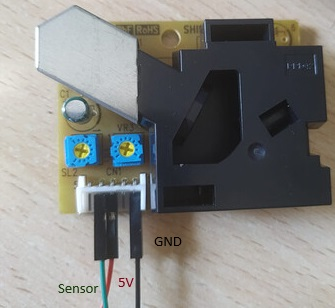

# PPD42NS Dust Sensor Driver for mbedOS

This is a driver for interfacing with the PPD42NS dust sensor using mbedOS on an STM32 microcontroller.

## Installation

To use this driver in your mbedOS project, simply copy the `PPD42NS.h` and `PPD42NS.cpp` files into your project directory.

## Usage

1. Connect the sensor to the STM32 Nucleo board:
   - Connect the sensor's VCC (5V) pin to the 5V pin on the Nucleo board.
   - Connect the sensor's GND pin to the GND pin on the Nucleo board.
   - Connect the sensor's data pin to the desired digital pin on the Nucleo board.

2. Include the necessary files in your mbedOS project:
   ```cpp
   #include "mbed.h"
   #include "PPD42NS.h"
   ```

3. Instantiate a `PPD42NS` object with the appropriate pin connected to the sensor:
   ```cpp
   PPD42NS dustSensor(D7); // Instantiate with pin D7 connected to the sensor
   ```

4. In the main loop, continuously read the dust density from the sensor and perform any desired actions:
   ```cpp
   int main() {
       while (true) {
           float dustDensity = dustSensor.readDustDensity();
           printf("Dust Density: %.2f particles per 0.01 cubic feet\n", dustDensity);
           ThisThread::sleep_for(30000); // Sampling interval
       }
   }
   ```

## Sensor Connections



## API

### `PPD42NS(PinName pin)`

Constructor for the `PPD42NS` class. Initializes the sensor with the specified pin.

- `pin`: PinName object representing the pin connected to the sensor.

### `~PPD42NS()`

Destructor for the `PPD42NS` class.

### `float readDustDensity()`

Reads the dust density from the sensor.

- Returns: The dust density in particles per 0.01 cubic feet.

## License

This driver is provided under the MIT License. See the [LICENSE](LICENSE) file for details.

Make sure to adjust the pin name and any other configurations according to your specific setup.